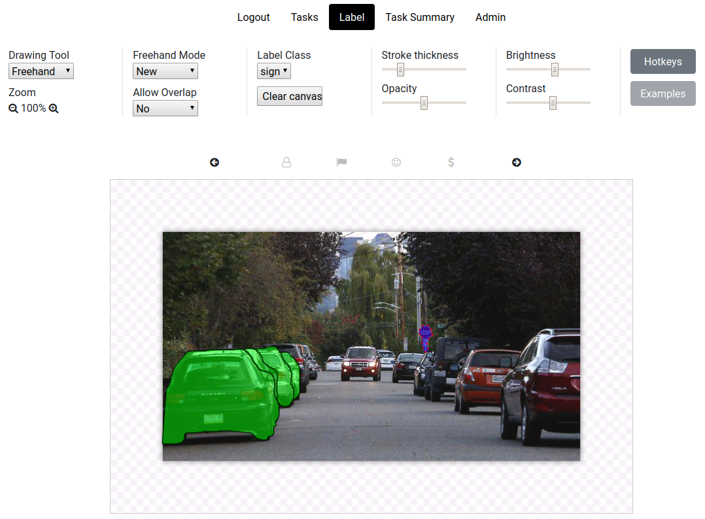

# README

## Overview

S3Label is an open-source browser-based image labeling tool developed by [Stone Three](https://www.stonethree.com/), a company in South Africa.
The goal of S3Label is to speed up the labeling of images for use in machine learning. 
It is particularly focused on instance segmentation, semantic segmentation and keypoints, although could easily be extended to classification and other types of labeling tasks too.

S3Label currently supports various types of labels:

| Label type | Description |
| ------     | ------      |
| Freehand | Click and drag a free-form polygon shape |
| Polygon | Click the individual polygon vertices |
| Rectangle | Click and drag to draw rectangular bounding boxes |
| Circle | Click and drag to draw circle |

The tool is designed to keep track of who labeled what data and to make the labeling process fast. 

Two types of user roles are available: *admin* and *normal* users:

| User role | Functionality available |
| ------    | ------      |
| Normal | Log in and label images. View own previously labeled images. |
| Admin | Same as Normal user, but also able to upload images for labeling, as well as to approve any other user's labeling. |

## Tutorials

1. [Installation](docs/installation.md)
1. [Logging in](docs/logging_in.md)
1. [Importing images for labeling](docs/upload_images.md)
1. [How to label images](./docs/how_to_label.md)
1. [Exporting labels](docs/export_labels.md)
1. [Payment tracking](./docs/making_payments.md)
1. [Upgrading S3Label version](./docs/upgrade_s3label.md)
1. [Useful SQL queries](./docs/useful_sql_queries.md)
1. [Roadmap](./docs/roadmap.md)

## Architecture

* Front-end: VueJS
* Back-end: Flask
* Database: Postgres

See [here](./docs/architecture.md) for a more thorough description and diagram of the S3Label architecture.
