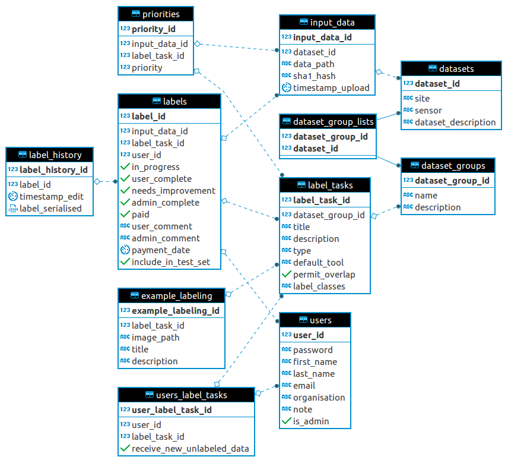

# Architecture

S3Label has been designed to be flexible in the types of data that can be labeled. 
Currently only image labeling is supported in the front-end UI, but the back-end can theoretically support any type of data that can be stored as a file and the labels stored in JSON format. Of course, the front-end would need to be made capable of displaying and labeling this data.

Here is a diagram of the back-end architecture:

## Notes about the architecture

* An *input_data_item* (in most situations, an image path with other meta-data) belongs to a particular *dataset*.
* A *dataset* has a many-to-many relationship with *dataset_group(s)*.
* A *label_task* can be associated with only one *dataset_group*.
    * However, multiple different *label_tasks* can be assigned to the same *dataset_group*.
* A label corresponds to a particular combination of user, input data item and label task.
    * This means that the same user can label the same image in a different label task, if the image has been assigned to two different label tasks.
    * It also means that two different users could label the same image in the same label task. However, this is prevented by the SQL query that retrieves the next image for labeling.
* When a user draws a label on an image and then switches to the next or previous image for labeling, the label is uploaded to the server and stored in the database. The complete history of these edits is kept in the *label_history* table.
    * When the labels are later exported, the most recent label history item for each label is selected for exporting.
    * Therefore, all labeling by the user is done non-destructively.
* A label task has to be assigned to a user before that user is able to view and label items in that label task.
* The *example_labeling* table is used to display example of how to label images in a particular label task. This is useful when there are many users labeling images and it takes time to show users how to label.
* Payments are tracked by toggling the *user complete*, *admin complete* and *paid* fields for each label.
* All labels are stored as JSON and serialised. 
