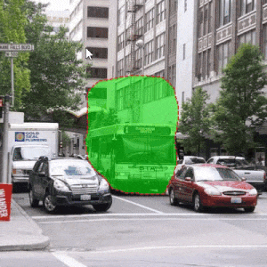

# LABELLING

## Freehand Selection

## Append Selection
Hold in the SHIFT key while selecting the new section to append it to the current selection.

## Erase Selection
Hold in the ALT key while selecting the section to be erased from the current selection.

